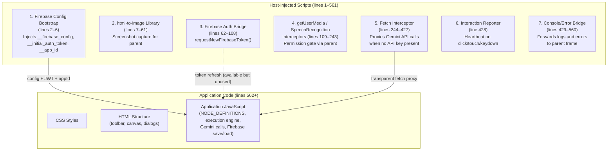
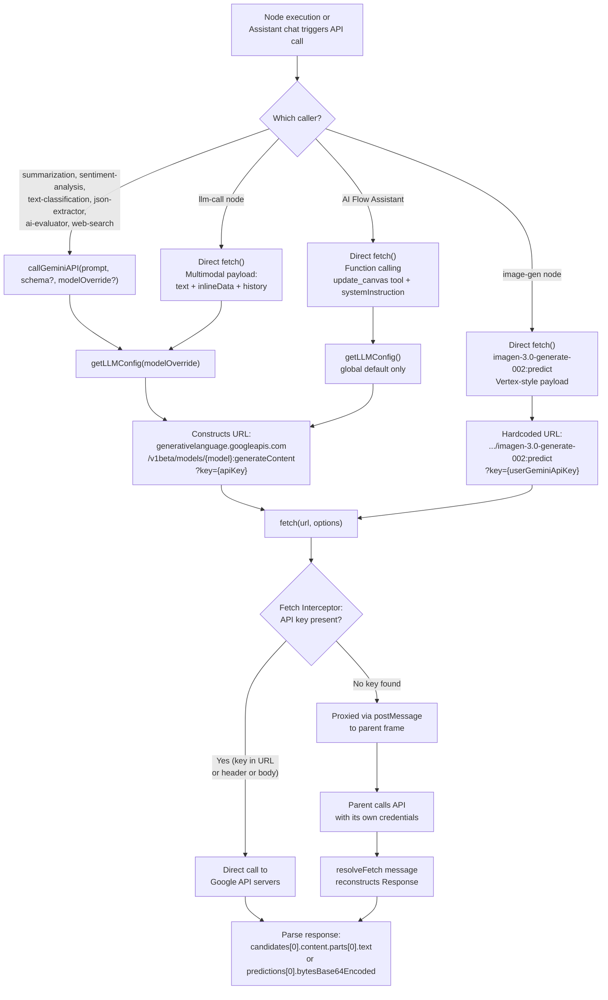
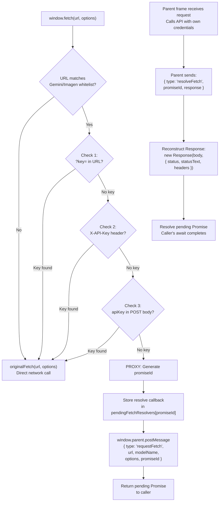
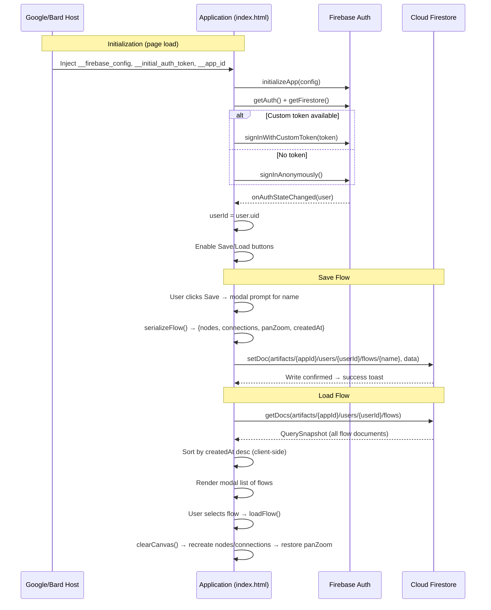
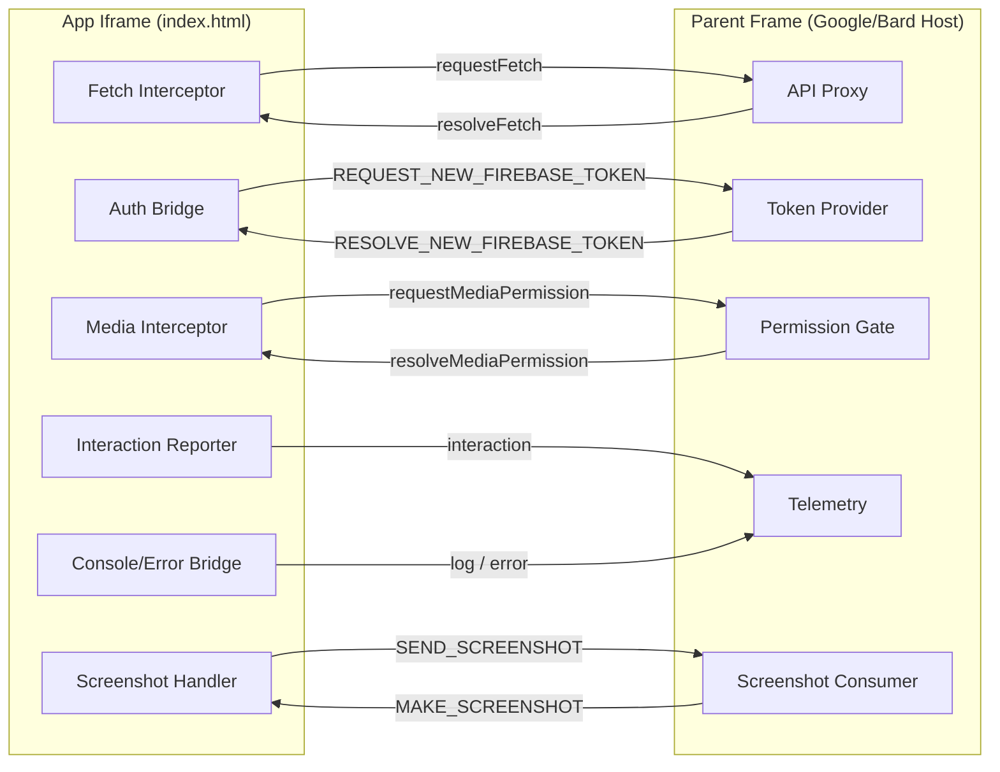

# AI Flow Visualizer — Internal Documentation

This document describes the inner workings of the AI Flow Visualizer, focusing on Gemini API integration, Firebase integration, and all external network calls. The entire application lives in a single `index.html` file (~4500 lines).

---

## 1. Architecture Overview

The file has two distinct layers. **Lines 1–561** contain host-injected infrastructure scripts prepended by the Google/Bard embedding platform — these are not application logic. **Lines 562+** contain the actual application: CSS, HTML, and vanilla JavaScript (ES Modules for Firebase, inline `<script>` for everything else).

The app runs inside an iframe. The host scripts intercept browser APIs (`fetch`, `getUserMedia`, `console`, `SpeechRecognition`) to proxy requests through the parent frame, gate permissions, and forward telemetry.



---

## 2. Gemini API Integration

### 2.1 API Key and Model Resolution

All Gemini API calls route through `getLLMConfig()` (line ~3208), which resolves the model and API key using this priority chain:

1. **Node-level model override** (`node.data.model`) — set via per-node `<select>` dropdown (only on `llm-call` and `ai-evaluator` nodes)
2. **Global default model** (`globalDefaultModel`) — set in the LLM Settings dialog
3. **Environment fallback** — `gemini-2.5-flash-preview-05-20` (hardcoded as `DEFAULT_ENV_MODEL`)

When no user API key is set (`userGeminiApiKey` is empty), any non-default model override is silently ignored and the model is forced to `DEFAULT_ENV_MODEL`. The resulting `fetch` call has an empty `?key=` param, which causes the fetch interceptor to proxy it to the parent frame.

Available models (configurable in Settings dialog with a user-provided API key):

| Model ID | Display Name |
|----------|-------------|
| `gemini-2.5-flash-preview-05-20` | Gemini 2.5 Flash (Default) |
| `gemini-1.5-pro-latest` | Gemini 1.5 Pro |
| `gemini-2.5-pro` | Gemini 2.5 Pro |

`getLLMConfig()` returns:
```js
{ apiKey: string, modelId: string, url: "https://generativelanguage.googleapis.com/v1beta/models/{modelId}:generateContent?key={apiKey}" }
```

### 2.2 `callGeminiAPI()` — Shared Helper

**Signature:** `callGeminiAPI(prompt, jsonSchema = null, modelOverride = null)`

This is the common entry point for most AI nodes. Key behaviors:

- Sends a **single-turn**, **non-streaming** request to `:generateContent`
- Payload: `{ contents: [{ role: "user", parts: [{ text: prompt }] }] }`
- When `jsonSchema` is provided, adds `generationConfig: { responseMimeType: "application/json", responseSchema: jsonSchema }` — the API returns JSON as a string inside `parts[0].text`, which the function parses with `JSON.parse()`
- Without a schema, returns the raw trimmed text from `candidates[0].content.parts[0].text`
- Throws on non-2xx HTTP responses

### 2.3 Per-Node Gemini Usage

| Node Type | Call Method | JSON Schema | Model Override | Purpose |
|-----------|-----------|-------------|----------------|---------|
| `summarization` | `callGeminiAPI` | None | Yes | Concise text summary |
| `sentiment-analysis` | `callGeminiAPI` | `{ sentiment: STRING, score: NUMBER }` | Yes | Sentiment label + confidence |
| `text-classification` | `callGeminiAPI` | None | Yes | Single-label classification into user-defined categories |
| `json-extractor` | `callGeminiAPI` | User-defined (from node config) | Yes | Structured data extraction from text |
| `ai-evaluator` | `callGeminiAPI` | `{ verdict: "PASS"\|"FAIL", feedback: STRING }` | Yes | Pass/fail judgment for autonomous loops |
| `web-search` | `callGeminiAPI` | None | Yes | Simulated search — asks LLM to synthesize results (not a real web search) |
| `llm-call` | Direct `fetch` | None | Yes | Generic multimodal LLM call (text + images + PDF + history) |
| `image-gen` | Direct `fetch` | N/A (Predict API) | No (hardcoded) | Image generation via Imagen |
| AI Flow Assistant | Direct `fetch` + tools | Function calling | No (global only) | Builds/modifies flows via `update_canvas` tool |

### 2.4 LLM Call Node — Direct Multimodal Fetch

The `llm-call` node (line ~3831) bypasses `callGeminiAPI()` because it needs capabilities the shared helper doesn't support:

- **Multimodal content**: `inlineData` parts for images (webcam, file upload, drawing canvas) and audio
- **PDF support**: Extracts text via PDF.js before sending as a text part
- **Conversation history**: Formats history arrays from `history-manager` nodes as context text
- **System prompt**: Injected as a fake `user`/`model` exchange pair prepended to `contents[]` (not using the `systemInstruction` API field)
- **Structured chat input**: Handles `{ text, media }` objects from `chat-interface` nodes

The payload structure is standard `contents: [{ role, parts }]` but with multiple heterogeneous parts per turn.

### 2.5 Image Generation — Imagen API

The `image-gen` node (line ~3908) uses a completely different API format:

- **Endpoint**: `https://generativelanguage.googleapis.com/v1beta/models/imagen-3.0-generate-002:predict?key={apiKey}`
- **Model**: Hardcoded `imagen-3.0-generate-002` — does not use `getLLMConfig()` for the URL, only reads `userGeminiApiKey` directly
- **Payload** (Vertex/Predict style):
  ```json
  { "instances": [{ "prompt": "..." }], "parameters": { "sampleCount": 1 } }
  ```
- **Response**: `predictions[0].bytesBase64Encoded` → returned as `data:image/png;base64,...` data URL
- The fetch interceptor covers this URL (listed in `deprecatedImageModelNames` whitelist), so it is proxied when no API key is set

### 2.6 AI Flow Assistant — Function Calling

The floating action button (bottom-right) opens a Gemini-powered chat that can build and modify flows programmatically.

- Uses `getLLMConfig()` with no arguments — always uses the global default model
- **Multi-turn**: Maintains a `chatHistory[]` array that accumulates across the session
- Uses the `systemInstruction` API field (unlike the `llm-call` node) with a prompt that includes:
  - All `NODE_DEFINITIONS` serialized with their data schemas
  - Current canvas state from `getCanvasState()` (all nodes and connections)
  - Layout rules (left-to-right, 350px spacing, autonomous loop patterns)
- **Tool declaration**:
  ```json
  { "functionDeclarations": [{ "name": "update_canvas", "parameters": {
      "clear_first": "BOOLEAN",
      "nodes_to_create": [{ "id", "type", "x", "y", "data" }],
      "nodes_to_update": [{ "id", "data" }],
      "connections_to_create": [{ "from_node_id", "from_port_index", "to_node_id", "to_port_index" }]
  }}]}
  ```
- When the response contains `part.functionCall.name === "update_canvas"`, `applyCanvasChanges(args)` is called, which:
  1. Optionally clears the canvas (`clear_first`)
  2. Creates nodes, mapping temporary IDs to real IDs via `idMap`
  3. Updates existing nodes' data
  4. Creates connections using the ID map for newly-created nodes

### Gemini Call Routing Diagram



---

## 3. Fetch Interceptor (Host-Proxied API Calls)

### 3.1 Why It Exists

When the app runs inside the Google/Bard iframe without a user-provided API key, it cannot call Gemini APIs directly. The parent host has credentials. The fetch interceptor (lines 244–427) monkey-patches `window.fetch` so that qualifying API calls are transparently forwarded to the parent frame via `postMessage`. To the calling code, `await fetch(url)` behaves identically whether the request goes direct or is proxied.

### 3.2 URL Whitelist

The interceptor receives a `modelInformation` config object (injected at line 428) listing all model names. It builds a whitelist of URL prefixes covering:

| Category | Model(s) | Operations |
|----------|---------|------------|
| Text (active) | `gemini-3-flash-preview` | `:streamGenerateContent`, `:generateContent` |
| Text (deprecated) | `gemini-2.0-flash`, `gemini-2.5-flash`, `gemini-2.5-flash-preview-04-17`, `gemini-2.5-flash-preview-05-20`, `gemini-2.5-flash-preview-09-2025` | `:streamGenerateContent`, `:generateContent` |
| Image (active) | `imagen-4.0-generate-001` | `:predict`, `:predictLongRunning` |
| Image (deprecated) | `imagen-3.0-generate-001`, `imagen-3.0-generate-002` | `:predict`, `:predictLongRunning` |
| Image edit | `gemini-2.5-flash-image-preview` | `:generateContent` |
| Image transform | `gemini-3-pro-image-preview-11-2025` | `:generateContent` |
| Video | `veo-2.0-generate-001` | `:predict`, `:predictLongRunning` |
| TTS | `gemini-2.5-flash-preview-tts` | `:generateContent` |

All URLs are prefixed with `https://generativelanguage.googleapis.com/v1beta/models/`.

> **Note**: The app code uses `gemini-2.5-flash-preview-05-20` (listed under deprecated text models) and `imagen-3.0-generate-002` (listed under deprecated image models). The interceptor covers both.

### 3.3 API Key Detection

When a `fetch` URL matches the whitelist, the interceptor checks for an API key in three places (in order):

1. **URL query parameter**: `?key=...` — parsed from the URL string
2. **Request header**: `X-API-Key` or `x-api-key`
3. **Request body**: JSON field `apiKey` (only for POST/PUT/PATCH)

If any check finds a non-empty key, the request passes through to the original `fetch`. If all three fail, the request is proxied.

### 3.4 Proxy Mechanism

When proxying:
1. A unique `promiseId` is generated
2. The request is serialized: `{ url, modelName, options: { method, headers, body } }`
3. `window.parent.postMessage({ type: 'requestFetch', ... }, '*')` is sent
4. A pending `Promise` is returned to the caller
5. The parent frame makes the API call with its own credentials
6. The parent sends back `{ type: 'resolveFetch', promiseId, response: { body, status, statusText, headers } }`
7. The interceptor reconstructs a `Response` object and resolves the promise

`ReadableStream` bodies are serialized as `null` (streaming responses lose their body in the proxy).



---

## 4. Firebase Integration

### 4.1 SDK and Config

Firebase SDK **v11.6.1** is loaded as ES modules from `https://www.gstatic.com/firebasejs/11.6.1/`. Three packages are imported:

| Package | Symbols Used |
|---------|-------------|
| `firebase-app` | `initializeApp` |
| `firebase-auth` | `getAuth`, `signInAnonymously`, `signInWithCustomToken`, `onAuthStateChanged` |
| `firebase-firestore` | `getFirestore`, `doc`, `setDoc`, `getDocs`, `collection`, `serverTimestamp` |

> `deleteDoc`, `getDoc`, `updateDoc`, and `Timestamp` are also imported but **never called** in the application code.

Configuration is injected by the host at lines 2–6 into three window globals:

| Global | Value | Purpose |
|--------|-------|---------|
| `window.__firebase_config` | JSON string with `apiKey`, `authDomain`, `projectId`, etc. for project `bard-frontend` | Firebase app config |
| `window.__initial_auth_token` | RS256 JWT signed by the `bard-frontend` service account | Custom auth token |
| `window.__app_id` | `"65563430d0ed-index.html-447"` | Firestore path segment |

If `__firebase_config` is null (e.g., running locally outside the host), Firebase is not initialized and the app enters **Local Mode** with Save/Load buttons permanently disabled.

### 4.2 Authentication Flow

`initializeFirebase()` (line ~1596):

1. `initializeApp(firebaseConfig)` → `getAuth(app)` → `getFirestore(app)`
2. Registers `onAuthStateChanged` listener — enables Save/Load buttons when authenticated, disables on sign-out
3. **Primary path**: `signInWithCustomToken(auth, __initial_auth_token)` — uses the host-provided JWT
4. **Fallback**: `signInAnonymously(auth)` — when no initial token is available
5. On success, `userId = user.uid` is stored for constructing Firestore document paths
6. On error, both buttons are disabled and status shows "Storage Error"

The host-injected `window.requestNewFirebaseToken()` function (lines 62–108) provides a `postMessage`-based token refresh mechanism, but it is **never called** by the application code — it exists as scaffolding for the host to push renewed tokens.

### 4.3 Firestore Data Model

**Collection path**: `artifacts/{appId}/users/{userId}/flows/{flowName}`

- `{appId}` — from `window.__app_id` (fallback: `'ai-flow-visualizer-v1'`)
- `{userId}` — Firebase Auth UID from `onAuthStateChanged`
- `{flowName}` — user-provided string, used as the document ID

**Document shape** (produced by `serializeFlow()` at line ~1643):

```json
{
  "nodes": [
    { "id": "node_llm-call_1718000000000_ab3fg", "type": "llm-call", "x": 400, "y": 200, "data": { "model": "gemini-1.5-pro-latest" } }
  ],
  "connections": [
    { "fromNode": "node_text-input_...", "fromPortIndex": 0, "toNode": "node_llm-call_...", "toPortIndex": 1 }
  ],
  "panZoom": { "x": 0, "y": 0, "scale": 1 },
  "createdAt": "<Firestore ServerTimestamp>"
}
```

Notable serialization details:
- `node.data` contents vary by node type (e.g., `text-input` stores `value`, `web-request` stores `url`/`method`/`headers`, `llm-call` stores `model`)
- `history-manager` internal state (`internalState.buffer`) is **not serialized** — history is lost on save/load
- `text-input` / `system-prompt` textarea values are read from the DOM at execution time, not always persisted in `node.data`

### 4.4 Save Flow

`saveFlow()` (line ~1738):

1. Guards on `userId && db` — shows error toast if not authenticated
2. Opens `showModalDialog()` with text input for the flow name
3. Calls `serializeFlow()` to capture current canvas state
4. `setDoc(doc(db, "artifacts", appId, "users", userId, "flows", flowName), flowData)`
5. Uses `setDoc` (not `addDoc`) — the flow name **is** the document ID, so saving with the same name silently **overwrites**

### 4.5 Load Flow

`showLoadFlowDialog()` (line ~1776):

1. Guards on `userId && db`
2. `getDocs(collection(...))` fetches **all** flow documents at once (no pagination, no Firestore `orderBy`)
3. Sorts by `createdAt` descending **in JavaScript** (avoids Firestore composite index requirement)
4. Renders a modal list showing flow name + formatted timestamp
5. On selection, calls `loadFlow(flowData, flowName)` which:
   - Clears the entire canvas
   - Recreates each node via `createNode(type, x, y, data, id)` — preserves original IDs
   - Recreates connections, resolving both Firestore format (`fromNode`/`toNode`) and built-in module format (`from`/`to`)
   - Restores `panZoom` camera state

There is **no delete or rename UI** for saved flows.



---

## 5. All External Calls Reference

### 5.1 CDN Resources (Loaded at Page Parse Time)

| Resource | URL | Version | Purpose |
|----------|-----|---------|---------|
| Firebase App | `https://www.gstatic.com/firebasejs/11.6.1/firebase-app.js` | 11.6.1 | App initialization |
| Firebase Auth | `https://www.gstatic.com/firebasejs/11.6.1/firebase-auth.js` | 11.6.1 | Authentication |
| Firebase Firestore | `https://www.gstatic.com/firebasejs/11.6.1/firebase-firestore.js` | 11.6.1 | Database read/write |
| Google Fonts | `https://fonts.googleapis.com/css2?family=Roboto:wght@400;500;700&family=Roboto+Mono&display=swap` | N/A | UI typography (Roboto + Roboto Mono) |
| Material Symbols | `https://fonts.googleapis.com/css2?family=Material+Symbols+Outlined:opsz,wght,FILL,GRAD@20..48,100..700,0..1,-50..200` | N/A | Icon font for node/toolbar icons |
| Marked.js | `https://cdn.jsdelivr.net/npm/marked/marked.min.js` | Latest | Markdown rendering in Display Value node and AI chat |
| PDF.js | `https://cdnjs.cloudflare.com/ajax/libs/pdf.js/3.11.174/pdf.min.js` | 3.11.174 | PDF text extraction and visual rendering |
| PDF.js Worker | `https://cdnjs.cloudflare.com/ajax/libs/pdf.js/3.11.174/pdf.worker.min.js` | 3.11.174 | Off-main-thread PDF parsing |

### 5.2 Gemini / Imagen API Endpoints (Runtime)

| Endpoint Pattern | Method | Callers | Notes |
|-----------------|--------|---------|-------|
| `generativelanguage.googleapis.com/v1beta/models/{model}:generateContent` | POST | `callGeminiAPI()`, `llm-call` node, AI Flow Assistant | Non-streaming; all text/structured output calls |
| `generativelanguage.googleapis.com/v1beta/models/imagen-3.0-generate-002:predict` | POST | `image-gen` node | Vertex-style payload; hardcoded model |

Both endpoints are subject to the fetch interceptor — proxied via `postMessage` when no API key is present.

### 5.3 Web Request Node (User-Configured)

The `web-request` node makes arbitrary HTTP calls via `fetch(url, { method, headers, body })` where all parameters are user-supplied. These calls pass through the fetch interceptor but are **not intercepted** (they don't match the Gemini/Imagen URL whitelist). Supports GET, POST, PUT, DELETE methods with custom JSON headers and auto-detection of JSON vs text responses.

Example default URL in the "API Data Processing" module template: `https://jsonplaceholder.typicode.com/todos/1`

### 5.4 postMessage Protocol (Iframe ↔ Parent)

**Outbound messages (app → parent frame):**

| Message `type` | Sender Script | Key Payload Fields | Purpose |
|---------------|--------------|-------------------|---------|
| `requestFetch` | Fetch interceptor | `url`, `modelName`, `options` (method/headers/body), `promiseId` | Proxy Gemini/Imagen API call through host |
| `REQUEST_NEW_FIREBASE_TOKEN` | Firebase auth bridge | `promiseId` | Request fresh Firebase auth token from host |
| `requestMediaPermission` | getUserMedia interceptor | `constraints`, `promiseId` | Gate camera/mic access through host permission dialog |
| `interaction` | Interaction reporter | _(none)_ | Activity heartbeat on every click, touch, or keydown |
| `log` | Console bridge | `message` | Forward `console.log` output to host |
| `error` | Console/error bridge | `source` (CONSOLE_ERROR / global / unhandledrejection), `message`, `name`, `stack`, `timestamp` | Forward errors and unhandled rejections |
| `SEND_SCREENSHOT` | html-to-image handler | `image` (data URL), `topOffset` | Respond to screenshot request |
| `SEND_SCREENSHOT_FOR_DATA_VISUALIZATION` | html-to-image handler | `image` (data URL), `topOffset: 0` | Respond to data viz screenshot request |

**Inbound messages (parent frame → app):**

| Message `type` | Handler Script | Key Payload Fields | Purpose |
|---------------|---------------|-------------------|---------|
| `resolveFetch` | Fetch interceptor | `promiseId`, `response` (body/status/statusText/headers) | Return proxied API response |
| `RESOLVE_NEW_FIREBASE_TOKEN` | Firebase auth bridge | `promiseId`, `success`, `token`, `error` | Return refreshed Firebase auth token |
| `resolveMediaPermission` | getUserMedia interceptor | `promiseId`, `granted` | Return media permission decision |
| `MAKE_SCREENSHOT` | html-to-image handler | _(none)_ | Trigger full-page screenshot capture |
| `MAKE_SCREENSHOT_FOR_DATA_VISUALIZATION` | html-to-image handler | _(none)_ | Trigger data visualization screenshot capture |



---

## 6. Host-Injected Scripts Reference

| # | Lines | Script | Globals / Overrides | Purpose |
|---|-------|--------|-------------------|---------|
| 1 | 2–6 | Firebase Config Bootstrap | `window.__firebase_config`, `window.__initial_auth_token`, `window.__app_id` | Injects Firebase project config (project `bard-frontend`), a signed JWT for custom auth, and an app identifier used in Firestore paths |
| 2 | 7–61 | html-to-image Library | Internal IIFE; origin whitelist: `gemini.google.com`, `corp.google.com`, `proxy.googlers.com` | MIT-licensed DOM-to-image library; captures `document.body` as PNG data URL on `MAKE_SCREENSHOT` message from whitelisted origins |
| 3 | 62–108 | Firebase Auth Bridge | `window.requestNewFirebaseToken` | Provides a `postMessage`-based token refresh relay; the function is defined but **never called** by the app — available for the host to trigger proactively |
| 4 | 109–243 | getUserMedia / SpeechRecognition Interceptors | Overrides `navigator.mediaDevices.getUserMedia`, `window.SpeechRecognition`, `window.webkitSpeechRecognition` | Routes all camera/mic/speech permission requests through the parent frame; blocks access until parent grants via `resolveMediaPermission` |
| 5 | 244–427 | Fetch Interceptor | Overrides `window.fetch` | Intercepts `fetch` calls to Gemini/Imagen API endpoints; if no API key is found in the request, proxies through parent via `requestFetch`/`resolveFetch` postMessage pair |
| 6 | 428 | Interaction Reporter | _(none)_ | Sends `{ type: "interaction" }` to parent on every `click`, `touchstart`, and `keydown` as an activity heartbeat |
| 7 | 429–560 | Console/Error Bridge | Overrides `console.log`, `console.error` | Forwards all console output, uncaught errors (`window.onerror`), and unhandled promise rejections to parent via `log` and `error` postMessages |
