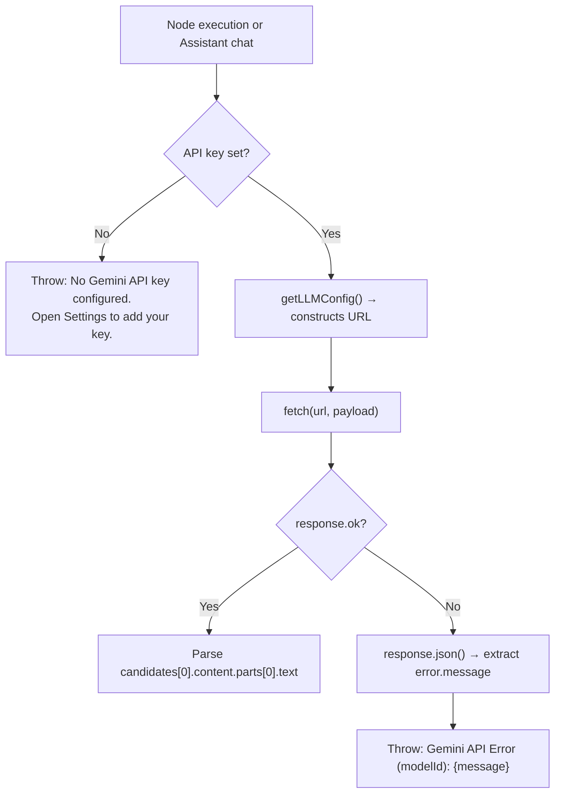
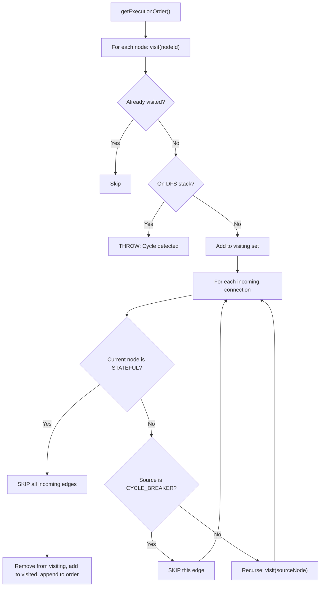
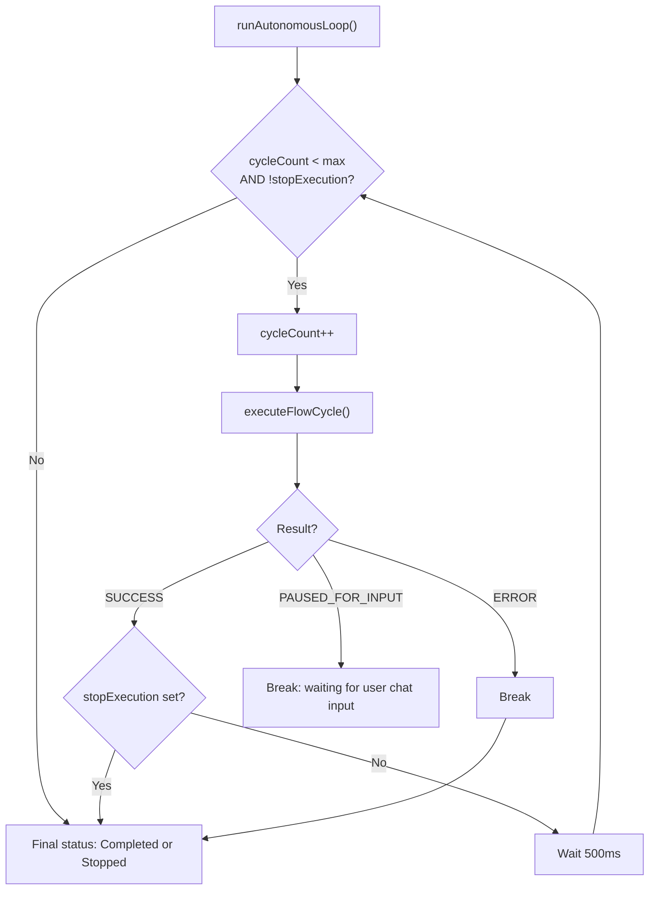

# AI Flow Visualizer — Internal Documentation

This document describes the inner workings of the AI Flow Visualizer: module architecture, Gemini API integration, storage, execution engine, node system, and canvas interaction.

---

## 1. Architecture Overview

The application is a **standalone static site** — no build tools, no server, no authentication required. It runs directly from `index.html` served over HTTP (ES modules require a server; `file://` does not work).

### 1.1 File Structure

```
ai-flow-visualizer/
├── index.html                 # Slim HTML shell (126 lines)
├── css/
│   └── styles.css             # All CSS (522 lines)
└── js/
    ├── main.js                # Entry point: init(), wires all event listeners
    ├── state.js               # DOM refs, constants, shared mutable state object
    ├── node-definitions.js    # NODE_DEFINITIONS + createModelSelectorHTML
    ├── modules.js             # MODULES predefined flows, loadFlow, clearCanvas
    ├── gemini-api.js          # getLLMConfig, callGeminiAPI
    ├── storage.js             # serializeFlow, localStorage save/load, JSON export/import
    ├── canvas.js              # updateTransform, pan/zoom/drag/drop
    ├── connections.js         # getPortCoords, drawConnection, updateAllConnections, CRUD
    ├── node-creation.js       # createNode, rebuildNodeIO, deleteNode, copyNodeOutput
    ├── node-initializers.js   # All initXxxNode functions, updateNode, runStringFormatter
    ├── node-execution.js      # executeNode switch dispatch + helpers
    ├── execution-engine.js    # getExecutionOrder, executeFlowCycle, runAutonomousLoop
    ├── display.js             # renderDisplayValueContent, PDF rendering
    ├── ui.js                  # showToast, setStatus, showModalDialog, showSettingsModal
    └── assistant.js           # AI assistant chat: toggleChat, applyCanvasChanges
```

### 1.2 Module Dependency Graph

```
state.js              ← no imports (leaf)
node-definitions.js   ← state.js
ui.js                 ← state.js, node-definitions.js
display.js            ← state.js
connections.js        ← state.js, ui.js
canvas.js             ← state.js, connections.js
gemini-api.js         ← state.js
node-creation.js      ← state.js, node-definitions.js, connections.js, node-initializers.js
node-initializers.js  ← state.js, connections.js, node-creation.js, ui.js
node-execution.js     ← state.js, gemini-api.js, display.js, ui.js, node-initializers.js
execution-engine.js   ← state.js, node-execution.js, ui.js
modules.js            ← state.js, node-creation.js, connections.js, canvas.js, ui.js
storage.js            ← state.js, ui.js, modules.js
assistant.js          ← state.js, node-definitions.js, node-creation.js, connections.js, gemini-api.js
main.js               ← all modules
```

Circular references between `node-creation` ↔ `node-initializers` ↔ `execution-engine` ↔ `node-execution` are safe — all cross-references are inside function bodies, never at module evaluation time.

### 1.3 State Management

All shared mutable state lives in a single exported `state` object in `state.js`. DOM element references and constants are also exported directly from the same file.

```js
// state.js — three kinds of exports:
export const canvas = document.getElementById('node-canvas'); // DOM refs
export const GRID_SIZE = 20;                                  // Constants
export const state = {                                        // Mutable state
    nodes: [],
    connections: [],
    panZoom: { scale: 1, x: 0, y: 0 },
    isExecuting: false,
    userGeminiApiKey: '',
    globalDefaultModel: DEFAULT_ENV_MODEL,
    // ...
};
```

ES module `<script type="module">` defers execution, so DOM queries at module scope are safe.

### 1.4 Core Data Structures

- `state.nodes[]` — `{ id, type, el (DOM element), data (config), outputBuffer, internalState }`
- `state.connections[]` — `{ id, fromNode, fromPortIndex, toNode, toPortIndex }`
- `state.panZoom` — `{ x, y, scale }` applied as CSS transform on `#canvas-wrapper`

---

## 2. Gemini API Integration

### 2.1 API Key and Model Resolution — `getLLMConfig()`

**File**: `js/gemini-api.js`

`getLLMConfig(nodeSpecificModel)` resolves the model and constructs the API URL:

1. If `state.userGeminiApiKey` is empty → throws immediately:
   `"No Gemini API key configured. Open Settings (gear icon) to add your API key."`
2. Resolves model: `nodeSpecificModel` → `state.globalDefaultModel`
3. Returns `{ apiKey, modelId, url }`

```js
// URL format
`https://generativelanguage.googleapis.com/v1beta/models/${modelId}:generateContent?key=${apiKey}`
```

The API key and default model are persisted in localStorage via the Settings modal (`aiflow_settings_apiKey`, `aiflow_settings_defaultModel`) and restored on startup in `main.js`.

### 2.2 Available Models

Defined as `GEMINI_MODELS` in `js/state.js`. The `DEFAULT_ENV_MODEL` is `gemini-3.1-flash-lite-preview`.

| Model ID                       | Display Name                                 |
| ------------------------------ | -------------------------------------------- |
| `gemini-3.1-flash-lite-preview`| Gemini 3.1 Flash Lite (Preview) (Default)    |
| `gemini-2.0-flash-lite`        | Gemini 2.0 Flash Lite                        |
| `gemini-flash-lite-latest`     | Gemini Flash Lite (Latest)                   |
| `gemini-flash-latest`          | Gemini Flash (Latest)                        |
| `gemini-2.5-flash-lite`        | Gemini 2.5 Flash Lite                        |
| `gemini-2.0-flash`             | Gemini 2.0 Flash                             |
| `gemini-2.5-flash`             | Gemini 2.5 Flash                             |
| `gemini-3.1-pro-preview`       | Gemini 3.1 Pro (Preview)                     |

### 2.3 `callGeminiAPI()` — Shared Helper

**Signature**: `callGeminiAPI(prompt, jsonSchema = null, modelOverride = null)`

- Sends a **single-turn**, **non-streaming** POST to `:generateContent`
- Payload: `{ contents: [{ role: "user", parts: [{ text: prompt }] }] }`
- When `jsonSchema` is provided, adds `generationConfig: { responseMimeType: "application/json", responseSchema: jsonSchema }` — response is parsed with `JSON.parse()`
- Without schema: returns raw trimmed text from `candidates[0].content.parts[0].text`
- On non-2xx response: reads the JSON error body and throws:
  `"Gemini API Error ({modelId}): {error.message from response body}"`

### 2.4 Per-Node Gemini Usage

| Node Type             | Call Method     | JSON Schema                                    | Model Override   | Purpose                                                                   |
| --------------------- | --------------- | ---------------------------------------------- | ---------------- | ------------------------------------------------------------------------- |
| `summarization`       | `callGeminiAPI` | None                                           | Yes              | Concise text summary                                                      |
| `sentiment-analysis`  | `callGeminiAPI` | `{ sentiment: STRING, score: NUMBER }`         | Yes              | Sentiment label + confidence                                              |
| `text-classification` | `callGeminiAPI` | None                                           | Yes              | Single-label classification into user-defined categories                  |
| `json-extractor`      | `callGeminiAPI` | User-defined (from node config)                | Yes              | Structured data extraction from text                                      |
| `ai-evaluator`        | `callGeminiAPI` | `{ verdict: "PASS"\|"FAIL", feedback: STRING }` | Yes             | Pass/fail judgment for autonomous loops                                   |
| `web-search`          | `callGeminiAPI` | None                                           | Yes              | Simulated search — asks LLM to synthesize results (not a real web search) |
| `llm-call`            | Direct `fetch`  | None                                           | Yes              | Generic multimodal LLM call (text + images + PDF + history)               |
| `image-gen`           | Direct `fetch`  | N/A (Predict API)                              | No (hardcoded)   | Image generation via Imagen                                               |
| AI Flow Assistant     | Direct `fetch`  | Function calling                               | No (global only) | Builds/modifies flows via `update_canvas` tool                            |

### 2.5 LLM Call Node — Direct Multimodal Fetch

**File**: `js/node-execution.js`, `llm-call` case

Bypasses `callGeminiAPI()` to support capabilities the shared helper doesn't provide:

- **Multimodal content**: `inlineData` parts for images (webcam, file upload, drawing canvas)
- **PDF support**: Extracts text via PDF.js before sending as a text part
- **Conversation history**: Formats history arrays from `history-manager` as context text
- **System prompt**: Injected as a fake `user`/`model` exchange pair prepended to `contents[]`
- **Structured chat input**: Handles `{ text, media }` objects from `chat-interface` nodes

On error, reads the JSON response body to extract `error.message` (same pattern as `callGeminiAPI`).

### 2.6 Image Generation — Imagen API

**File**: `js/node-execution.js`, `image-gen` case

- **Endpoint**: `https://generativelanguage.googleapis.com/v1beta/models/imagen-3.0-generate-002:predict?key={apiKey}`
- **Model**: Hardcoded — reads `state.userGeminiApiKey` directly (does not use `getLLMConfig()`)
- **Payload** (Vertex/Predict style):
  ```json
  { "instances": [{ "prompt": "..." }], "parameters": { "sampleCount": 1 } }
  ```
- **Response**: `predictions[0].bytesBase64Encoded` → returned as `data:image/png;base64,...`

### 2.7 AI Flow Assistant — Function Calling

**File**: `js/assistant.js`

The floating action button (bottom-right) opens a Gemini-powered chat that builds and modifies flows.

- Uses `getLLMConfig()` with no arguments — always uses the global default model
- **Multi-turn**: Maintains `state.chatHistory[]` across the session
- Uses the `systemInstruction` API field with a prompt including all `NODE_DEFINITIONS` and current canvas state
- **Tool declaration**:
  ```json
  { "functionDeclarations": [{ "name": "update_canvas", "parameters": {
      "clear_first": "BOOLEAN",
      "nodes_to_create": [{ "id", "type", "x", "y", "data" }],
      "nodes_to_update": [{ "id", "data" }],
      "connections_to_create": [{ "from_node_id", "from_port_index", "to_node_id", "to_port_index" }]
  }}]}
  ```
- When the response contains `part.functionCall.name === "update_canvas"`, `applyCanvasChanges(args)` is called, which optionally clears the canvas, creates nodes (mapping temp IDs to real IDs), updates existing nodes, and creates connections.

### 2.8 Error Handling

All API calls follow a consistent error pattern:

1. **No API key**: `getLLMConfig()` throws before any fetch: *"No Gemini API key configured. Open Settings (gear icon) to add your API key."*
2. **Non-2xx response**: The JSON error body is parsed; `error.message` from the body is used rather than the empty HTTP `statusText` (HTTP/2 responses have empty statusText):
   ```js
   let errorMessage = `HTTP ${response.status}`;
   try {
       const errBody = await response.json();
       if (errBody?.error?.message) errorMessage = errBody.error.message;
   } catch (_) {}
   throw new Error(`Gemini API Error (${modelId}): ${errorMessage}`);
   ```
3. **Node-level errors**: `executeNode` catches and displays `"Error in {Node Title}: {error.message}"` as a toast and sets the node border red.



---

## 3. Storage

All persistence uses **localStorage + JSON file I/O** — no server or database required.

**File**: `js/storage.js`

### 3.1 Save (localStorage)

1. `showModalDialog()` prompts for a flow name
2. `serializeFlow()` captures canvas state
3. `localStorage.setItem('aiflow_' + name, JSON.stringify(data))`
4. Saving with the same name silently overwrites

### 3.2 Load (localStorage)

1. Enumerate all `aiflow_*` keys (excludes `aiflow_settings_*`)
2. Render a modal list with flow name, saved date, and a delete button per entry
3. On selection, `loadFlow(parsed, name)` clears and rebuilds the canvas

### 3.3 Export (JSON file download)

1. `serializeFlow()` → `JSON.stringify()`
2. `Blob` → object URL → temporary `<a download>` → click → revoke

### 3.4 Import (JSON file upload)

1. Temporary `<input type="file" accept=".json">` appended to body
2. `FileReader.readAsText()` → `JSON.parse()` → `loadFlow()`

### 3.5 Settings Persistence

| Key                           | Value                         |
| ----------------------------- | ----------------------------- |
| `aiflow_settings_apiKey`      | Gemini API key (string)       |
| `aiflow_settings_defaultModel`| Selected model ID (string)    |

Restored in `init()` at startup:
```js
const savedApiKey = localStorage.getItem('aiflow_settings_apiKey');
if (savedApiKey) state.userGeminiApiKey = savedApiKey;
```

### 3.6 `serializeFlow()` — Document Shape

```json
{
  "nodes": [
    { "id": "node_llm-call_1718000000000_ab3fg", "type": "llm-call", "x": 400, "y": 200, "data": { "model": "gemini-2.0-flash-lite" } }
  ],
  "connections": [
    { "fromNode": "node_text-input_...", "fromPortIndex": 0, "toNode": "node_llm-call_...", "toPortIndex": 1 }
  ],
  "panZoom": { "x": 0, "y": 0, "scale": 1 },
  "createdAt": "2026-03-11T12:00:00.000Z"
}
```

Notable details:
- `node.data` contents vary by type (`text-input` stores `value`, `web-request` stores `url`/`method`/`headers`, etc.)
- `history-manager` internal state (`internalState.buffer`) is **not serialized** — history resets on load
- `text-input`/`system-prompt` textarea values are read from the DOM at execution time

---

## 4. CDN Dependencies

| Resource         | URL                                                                                  | Version  | Purpose                                     |
| ---------------- | ------------------------------------------------------------------------------------ | -------- | ------------------------------------------- |
| Google Fonts     | `fonts.googleapis.com` — Roboto + Roboto Mono                                        | N/A      | UI typography                               |
| Material Symbols | `fonts.googleapis.com` — Material Symbols Outlined                                   | N/A      | Node and toolbar icons                      |
| Marked.js        | `cdn.jsdelivr.net/npm/marked/marked.min.js`                                          | Latest   | Markdown rendering in Display Value + chat  |
| PDF.js           | `cdnjs.cloudflare.com/ajax/libs/pdf.js/3.11.174/pdf.min.js`                          | 3.11.174 | PDF text extraction and visual rendering    |
| PDF.js Worker    | `cdnjs.cloudflare.com/ajax/libs/pdf.js/3.11.174/pdf.worker.min.js`                   | 3.11.174 | Off-main-thread PDF parsing                 |

---

## 5. Node Type System

### 5.1 NODE_DEFINITIONS Structure

**File**: `js/node-definitions.js`

All node types are declared in `NODE_DEFINITIONS`, a plain object keyed by type string:

```js
{
  category: string,               // Grouping for the node library sidebar
  title: string,                  // Display name in the node header
  icon: string,                   // Material Symbol ligature name
  description: string,            // Tooltip/help text
  inputs: [{ name, dataType }],   // Input port definitions
  outputs: [{ name, dataType }],  // Output port definitions
  content(node): string           // Returns inner HTML for the node body
}
```

### 5.2 Complete Node Type Reference

#### Inputs / Media

| Type             | Title          | Inputs | Outputs                           | Key Behavior                                                                       |
| ---------------- | -------------- | ------ | --------------------------------- | ---------------------------------------------------------------------------------- |
| `text-input`     | Text Input     | —      | `Text (string)`                   | Textarea; reads `.node-value` at execution time                                    |
| `file-upload`    | File Upload    | —      | `File Data (string\|base64-media)`| File picker; PDFs → extracted text via PDF.js; others → base64 media object       |
| `webcam-capture` | Webcam Capture | —      | `Image Data (base64-data-url)`    | Video preview + capture button; stores in `internalState.imageData`                |
| `audio-recorder` | Audio Recorder | —      | `Audio Data (base64-media)`       | Record/stop/play; stores in `internalState.audioData`                              |
| `drawing-canvas` | Drawing Canvas | —      | `Drawing Image (base64-data-url)` | 294×200 canvas element; outputs `.toDataURL('image/png')`                          |

#### User Interaction

| Type             | Title                     | Inputs                                             | Outputs                  | Key Behavior                                                                                                                        |
| ---------------- | ------------------------- | -------------------------------------------------- | ------------------------ | ----------------------------------------------------------------------------------------------------------------------------------- |
| `chat-terminal`  | Chat Terminal (Pause)     | `Agent Message (string)`, `History (string\|array)`| `User Response (string)` | Modal dialog pause; blocks until user types. `CYCLE_BREAKER_TYPES` member                                                           |
| `chat-interface` | Chat Interface (Auto-Run) | `Agent Message (string)`                           | `User Response (object)` | Inline chat with file attach; outputs `{ text, media }`. User's Send button calls `startExecution()`. `CYCLE_BREAKER_TYPES` member  |

#### AI / Logic

| Type              | Title                    | Inputs                                                                                          | Outputs                       | Key Behavior                                                                                                                                           |
| ----------------- | ------------------------ | ----------------------------------------------------------------------------------------------- | ----------------------------- | ------------------------------------------------------------------------------------------------------------------------------------------------------ |
| `system-prompt`   | System Prompt            | —                                                                                               | `Prompt (string)`             | Textarea; behaves identically to `text-input`                                                                                                          |
| `llm-call`        | LLM Call (Gemini)        | `System (string)`, `User Prompt (string\|object)`, `Context/Media (string\|array\|base64-media)`| `Response (string)`           | Direct multimodal fetch; supports images, PDFs, history. Per-node model selector                                                                       |
| `ai-evaluator`    | AI Evaluator (Pass/Fail) | `Input to Evaluate (any)`, `Criteria (string)`                                                  | `Pass (any)`, `Fail (string)` | **Multi-output**: returns `{ index: 0\|1, data }`. Routes to PASS or FAIL port based on LLM verdict. Per-node model selector                           |
| `image-gen`       | Image Gen (Imagen)       | `Prompt (string)`                                                                               | `Image Data (base64-data-url)`| Calls Imagen API; returns base64 PNG                                                                                                                   |
| `history-manager` | History Manager          | `Append Input (any)`                                                                            | `History (array)`             | **Stateful**: `internalState.buffer` persists across cycles. Read-then-write: outputs buffer *before* appending. `STATEFUL_NODE_TYPES` member          |

#### Logic

| Type                | Title                 | Inputs          | Outputs                     | Key Behavior                                                                                                                    |
| ------------------- | --------------------- | --------------- | --------------------------- | ------------------------------------------------------------------------------------------------------------------------------- |
| `conditional-logic` | Conditional (If/Else) | `Input A (any)` | `True (any)`, `False (any)` | **Multi-output**: evaluates operator (equals/not_equals/contains/gt/lt/is_empty) against `valueB`. Returns `{ index: 0\|1, data }` |
| `stop-signal`       | Stop Signal           | `Trigger (any)` | —                           | Sets `state.stopAutonomousExecution = true` when triggered in autonomous mode                                                  |

#### Text Processing

| Type                  | Title               | Inputs                | Outputs             | Key Behavior                                              |
| --------------------- | ------------------- | --------------------- | ------------------- | --------------------------------------------------------- |
| `summarization`       | Summarization       | `Input Text (string)` | `Summary (string)`  | `callGeminiAPI`, no schema                                |
| `sentiment-analysis`  | Sentiment Analysis  | `Input Text (string)` | `Sentiment (json)`  | `callGeminiAPI`, schema `{ sentiment, score }`            |
| `text-classification` | Text Classification | `Input Text (string)` | `Category (string)` | `callGeminiAPI`, categories from `node.data.categories`   |

#### Integrations

| Type          | Title                  | Inputs               | Outputs                       | Key Behavior                                              |
| ------------- | ---------------------- | -------------------- | ----------------------------- | --------------------------------------------------------- |
| `web-request` | Web Request (API)      | `Body (string\|json)`| `Response Body (string\|json)`| User-configured URL/method/headers; direct `fetch()`      |
| `web-search`  | Web Search (Simulated) | `Query (string)`     | `Search Summary (string)`     | `callGeminiAPI` — simulates search results via LLM        |

#### Utilities

| Type               | Title            | Inputs                                | Outputs              | Key Behavior                                                                                 |
| ------------------ | ---------------- | ------------------------------------- | -------------------- | -------------------------------------------------------------------------------------------- |
| `string-formatter` | String Formatter | _(dynamic from template)_             | `Formatted (string)` | Template with `{variable}` placeholders; inputs created dynamically from template variables  |
| `math-operation`   | Math Operation   | `Value A (number)`, `Value B (number)`| `Result (number)`    | Operators: add/subtract/multiply/divide/modulo/power                                         |

#### Data Processing

| Type             | Title               | Inputs                          | Outputs                 | Key Behavior                                                              |
| ---------------- | ------------------- | ------------------------------- | ----------------------- | ------------------------------------------------------------------------- |
| `json-parser`    | JSON Parser         | `JSON Input (json\|string)`     | `Extracted Value (any)` | Parses JSON then navigates with dot/bracket path from `node.data.path`    |
| `json-extractor` | JSON Extractor (AI) | `Input Text (string)`           | `Extracted JSON (json)` | `callGeminiAPI` with user-defined schema from `node.data.schema`          |
| `code-runner`    | Code Runner (JS)    | `Input A (any)`, `Input B (any)`| `Result (any)`          | Executes `new Function('inputA', 'inputB', code)` with user-written JS    |

#### Output

| Type            | Title         | Inputs        | Outputs | Key Behavior                                                                                                  |
| --------------- | ------------- | ------------- | ------- | ------------------------------------------------------------------------------------------------------------- |
| `display-value` | Display Value | `Input (any)` | —       | Renders text, Markdown (via Marked.js), HTML (sandboxed iframe), images, audio, PDFs (PDF.js), or JSON        |

### 5.3 Special Node Categories

Three constants in `state.js` control how nodes interact with the execution engine:

```js
const STATEFUL_NODE_TYPES   = ['history-manager'];
const CYCLE_BREAKER_TYPES   = ['chat-terminal', 'chat-interface'];
// Multi-output nodes: 'conditional-logic', 'ai-evaluator'
```

- **Stateful nodes**: `outputBuffer` and `internalState` persist across cycles; never reset
- **Cycle breaker nodes**: Outgoing edges are skipped during topological sort; buffers cleared after a successful cycle (except `chat-terminal`)
- **Multi-output nodes**: Store `{ index: 0|1, data }` in `outputBuffer`; only the matching port's downstream receives data

---

## 6. Node Lifecycle

### 6.1 Node Creation — `createNode(type, x, y, data, id)`

**File**: `js/node-creation.js`

1. **ID**: `node_{type}_{Date.now()}_{random7chars}` — or preserved `id` when loading saved flows
2. **Node object**: `{ id, type, inputs, outputs, data, internalState: {}, outputBuffer: null, el }`
3. **DOM element**: `<div class="node" id="{nodeId}">` with header + content from `def.content(node)`
4. **Position**: Grid-snapped (`GRID_SIZE = 20px`), set via `style.left/top`
5. **Registration**: Appended to `#canvas-wrapper`, pushed to `state.nodes[]`
6. **Port rendering**: `rebuildNodeIO(node)` creates input/output port elements
7. **Type-specific init**: `initXxxNode` functions bind DOM controls to `node.data`

### 6.2 Port System — `rebuildNodeIO(node)`

Creates port DOM elements from `node.inputs[]` and `node.outputs[]`:

```html
<!-- Input port -->
<div class="node-io">
    <div id="{nodeId}_in_{i}" class="io-port input" data-port-index="{i}" title="{name} ({dataType})"></div>
    <label class="io-label">{name}</label>
</div>
<!-- Output port -->
<div class="node-io">
    <div id="{nodeId}_out_{i}" class="io-port output" data-port-index="{i}" title="{name} ({dataType})"></div>
    <label class="io-label">{name}</label>
</div>
```

- Output ports fire `startConnection()` on `mousedown`
- Input ports fire `endConnection()` on `mouseup`
- Guard at top prevents re-rendering after initial creation

### 6.3 Data Binding — `init*` Functions

**File**: `js/node-initializers.js`

All init functions follow: read `node.data` → set DOM value → add event listener that writes back to `node.data`.

| Init Function            | Node Type                  | Fields Synced                               |
| ------------------------ | -------------------------- | ------------------------------------------- |
| `initWebRequestNode`     | `web-request`              | `url`, `method`, `headers`                  |
| `initCodeRunnerNode`     | `code-runner`              | `code`                                      |
| `initJsonParserNode`     | `json-parser`              | `path`                                      |
| `initMathNode`           | `math-operation`           | `a`, `b`, `op` (also live-previews result)  |
| `initConditionalNode`    | `conditional-logic`        | `op`, `valueB`                              |
| `initStringFormatter`    | `string-formatter`         | `template` (triggers dynamic port rebuild)  |
| `initModelSelector`      | `llm-call`, `ai-evaluator` | `model` (per-node override)                 |
| `initAIEvaluatorNode`    | `ai-evaluator`             | `criteria`                                  |
| `initHistoryManagerNode` | `history-manager`          | `internalState.buffer = []`, Clear button   |

### 6.4 Dynamic Ports — String Formatter

The `string-formatter` starts with `inputs: []`. `updateFormatterInputsFromTemplate(node)` dynamically creates ports from `{variable}` placeholders in the template string — extracts variable names, diffs against current `node.inputs[]`, removes obsolete connections, updates inputs, remaps surviving connection port indices.

---

## 7. Connection System

### 7.1 Connection Data Model

**File**: `js/connections.js`

```js
connections[] = [{
    id: "conn_{fromNodeId}_{fromPortIndex}_to_{toNodeId}_{toPortIndex}",
    fromNode: string,       // Source node ID
    fromPortIndex: number,  // 0-based output port index
    fromPortId: string,     // "{nodeId}_out_{i}"
    toNode: string,         // Target node ID
    toPortIndex: number,    // 0-based input port index
    toPortId: string        // "{nodeId}_in_{i}"
}]
```

Duplicate prevention via ID check in `createConnection()`. Each input port accepts only one connection.

### 7.2 SVG Rendering

Connections are `<path>` elements in `<svg id="connections-layer">` inside `#canvas-wrapper` (transforms with the canvas).

`drawConnection(pathId, start, end)` renders a cubic Bezier:
```
M {start.x} {start.y} C {cx1} {start.y}, {cx2} {end.y}, {end.x} {end.y}
```
Control points offset horizontally by `max(50, |dx| × 0.6)`. `getPortCoords(portEl)` computes port center in canvas-wrapper space.

### 7.3 Connection Interaction

- **Creating**: `mousedown` on output port → live preview path → `mouseup` on input port finalizes
- **Selecting**: Click path → toggles `selected` class (yellow highlight)
- **Deleting**: Delete/Backspace with selected connection → removes from `state.connections[]` and DOM

---

## 8. Execution Engine

**File**: `js/execution-engine.js`

### 8.1 Topological Sort — `getExecutionOrder()`

Standard post-order DFS producing a topological ordering (dependencies before dependents).

**Two special cases break cycles:**

1. **Stateful nodes** (`history-manager`): All incoming dependency edges are skipped. The history manager reads its own persistent buffer first.
2. **Cycle breaker nodes** (`chat-terminal`, `chat-interface`): When the source of a connection is a cycle-breaker, that dependency edge is skipped.

If a genuine cycle is detected, returns `null` and shows an error toast.



### 8.2 Single Cycle — `executeFlowCycle()`

**Phase 1 — Reset**: Clear `outputBuffer` for all nodes except stateful, cycle-breaker, conditional-logic, and ai-evaluator. Remove all visual state classes.

**Phase 2 — Execute**: For each node in topological order:
1. Collect inputs from upstream `outputBuffer`s into `inputs[]` indexed by port
2. For multi-output nodes: only pass data if `fromPortIndex === outputBuffer.index`
3. Call `executeNode(nodeId, inputs)`
4. If result is `PAUSED_FOR_INPUT` → break immediately

**Phase 3 — Cleanup**: On success, clear `chat-interface` and multi-output node buffers.

Returns `CYCLE_RESULT.SUCCESS`, `CYCLE_RESULT.ERROR`, or `CYCLE_RESULT.PAUSED_FOR_INPUT`.

### 8.3 Node Execution — `executeNode(nodeId, inputData)`

**File**: `js/node-execution.js`

Large `switch(node.type)` dispatcher. For each node:
1. Adds `active` CSS class
2. Dispatches to type-specific logic
3. Stores output in `node.outputBuffer` (or `{ index, data }` for multi-output)
4. On success: adds `success` class
5. On error: adds `error` class, shows toast with `"Error in {Node Title}: {message}"`, re-throws to halt the cycle

**Error behavior**: One node failure = entire cycle failure = autonomous loop stops.

### 8.4 Autonomous Loop — `runAutonomousLoop()`



**Loop termination conditions:**
- `cycleCount >= maxAutonomousCycles` → "Autonomous run completed (N cycles)"
- `stopAutonomousExecution = true` (Stop button or `stop-signal` node) → "Goal Reached" or "Run stopped by user"
- `CYCLE_RESULT.ERROR` → stops silently (error already toasted)
- `CYCLE_RESULT.PAUSED_FOR_INPUT` → loop exits; re-triggered when user submits chat input

### 8.5 OutputBuffer Lifecycle

| Moment               | What Happens                                                                                                                                     |
| -------------------- | ------------------------------------------------------------------------------------------------------------------------------------------------ |
| **Cycle start**      | Reset to `null` for all nodes **except** stateful, cycle-breaker, conditional-logic, ai-evaluator                                                |
| **Node execution**   | Standard: `outputBuffer = output`. Multi-output: `outputBuffer = { index, data }`. Stateful/cycle-breaker: only overwritten if `output !== null` |
| **Input collection** | Downstream nodes read `fromNode.outputBuffer` (or `.data` for multi-output matching port) into `inputs[toPortIndex]`                             |
| **Cycle end**        | Clear `chat-interface`, conditional-logic, ai-evaluator buffers. `history-manager` buffer is **never cleared**                                   |

### 8.6 Visual Feedback During Execution

Node CSS classes during execution:

| Class     | Appearance              | Condition                            |
| --------- | ----------------------- | ------------------------------------ |
| `active`  | Blue pulsing glow       | Node is currently executing          |
| `paused`  | Amber glow              | Awaiting user input                  |
| `success` | Green border            | Node completed successfully          |
| `error`   | Red border + glow       | Node threw an error                  |

**Connection animation**: When a connection's data is consumed, the SVG path gets class `active` (marching-ants `stroke-dasharray: 8 6`), removed after the downstream node finishes.

**Status bar states**: `running` (blue — "Running: NodeTitle" or "Autonomous Cycle N/M"), `success` (green — "Flow completed!" or "Goal Reached"), `error` (red — "Error in NodeTitle"), `ready` (gray — "Ready").

---

## 9. Canvas Interaction

**File**: `js/canvas.js`

### 9.1 Pan and Zoom

All canvas state in `state.panZoom = { x, y, scale }`, applied as a single CSS transform:
```js
canvasWrapper.style.transform = `translate(${x}px, ${y}px) scale(${scale})`;
```

- **Pan**: `mousedown` on canvas/wrapper/SVG → `mousemove` → update `panZoom.x/y`
- **Zoom**: `wheel` + Ctrl/Cmd → adjusts `panZoom.scale` (range `0.2`–`2.5`) with zoom-toward-cursor math
- **Zoom buttons**: `±1.2×` multiplier

### 9.2 Node Dragging

`mousedown` on `.node-header` starts a drag. On `mousemove`:
- Delta divided by `panZoom.scale` — correct speed at any zoom level
- Grid-snapped when `state.snapToGrid` is enabled (`GRID_SIZE = 20px`)
- `updateAllConnections()` called each frame to redraw wires

### 9.3 Drag-and-Drop from Node Library

`dragover` + `drop` on `#node-canvas`: calculates canvas-space position accounting for `panZoom`, calls `createNode(type, x, y)`.

---

## 10. Predefined Modules

**File**: `js/modules.js`

The `MODULES` object defines 8 example flows. Each module has:
```js
{
  name: string,
  nodes: [{ type, x, y, data? }],
  connections: [{ from, fromPort, to, toPort, toPortName? }]
}
```

Connections use **array indices** for `from`/`to`. `loadFlow()` builds an index-to-node map during creation. `toPortName` resolves dynamic ports by name (used by `string-formatter` in `pdf-q-and-a`).

| Module Key                   | Name                               | Description                                                                                   |
| ---------------------------- | ---------------------------------- | --------------------------------------------------------------------------------------------- |
| `reflection-agent-loop`      | Reflection Agent (Self-Correction) | LLM + AI Evaluator + History Manager self-correction loop (**loaded by default on startup**)  |
| `autonomous-agent-loop`      | Autonomous Agent Loop              | LLM + History Manager feedback loop                                                           |
| `interactive-web-gen`        | Interactive Webpage Generator      | Text → LLM → Display (HTML output)                                                            |
| `sentiment-analysis-example` | Sentiment Analysis Example         | Text → Sentiment node → Display                                                               |
| `pdf-q-and-a`                | PDF Question & Answer              | File Upload + Text → String Formatter → LLM → Display                                        |
| `visual-storyteller-combined`| Visual Storyteller (Combined)      | LLM text + Imagen image → Code Runner → Display                                               |
| `api-data-processing`        | API Data Processing                | Web Request → JSON Parser → Code Runner → Display                                             |
| `blank`                      | Blank Canvas                       | Empty canvas                                                                                  |
